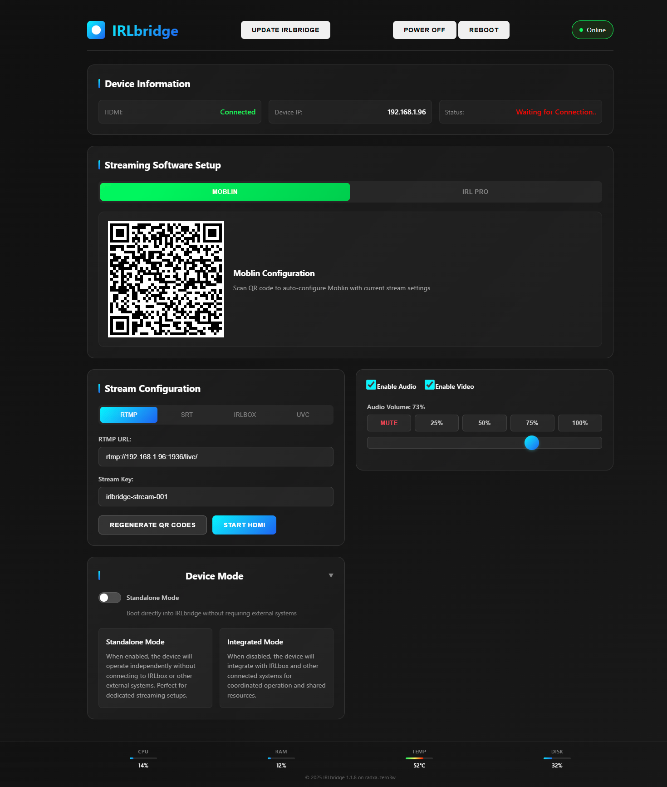

# Overview & Setup

**IRLbridge** is an add-on module for **IRLbox** that takes incoming **SRT**, **RTMP**, or **UVC** input and outputs it over the **HDMI port** of supported Orange Pi and Radxa devices.

This lightweight module lets you stream from your phone to popular devices such as **LiveU** encoders or output HDMI video with sound to external monitors.

## Overview

- **Input Protocols**: SRT, RTMP, UVC (USB capture)
- **Output**: HDMI (video + audio)
- **Supported Devices**: Orange Pi 5/5 Plus, Radxa Zero 3W, and similar SBCs with HDMI output
- **Use Cases**: IRL streaming, HDMI monitor output, LiveU integration

> **Note:** 

## Key Features

| Feature | Description |
|---------|-------------|
| Multiple Inputs | Accepts SRT, RTMP, and UVC sources. |
| HDMI Output | Real-time HDMI video + audio to monitors or encoders. |
| QR Code Setup | Instantly configure Moblin or IRL Pro streaming apps. |
| Standalone / Integrated Mode | Run independently or as part of IRLbox. |
| Lightweight UI | Minimal CPU/RAM overhead on SBCs. |

## Installation (Quick Steps)

1. Download the IRLbox image your SBC.
2. Flash the image or update your IRLbox to include IRLbridge.
3. Connect the device to your network and HDMI display.
4. Access the IRLbridge UI in your browser at the device IP.
5. Configure incoming stream settings, or UVC input, using the UI or QR code.
6. Access the IRLbridge dashboard via the `https://irlbox.local/IRLbridge` URL route

## Supported Hardware

| Device | Notes |
|--------|-------|
| Orange Pi 5 | Full support for HDMI + USB. |
| Radxa Zero 3W | Low power, portable form factor. |
| More SBCs coming soon | Continuous support updates. |
